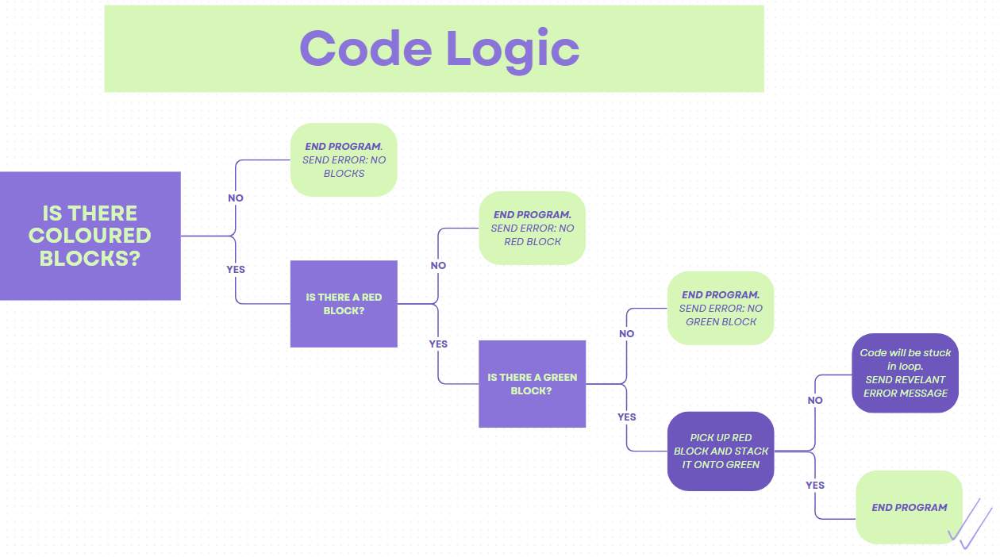

w# Sensors and Controls - Fetch Robot
Current implementation: Fetch robot to stack a red block ontop of a green block.

Future implmentation: Fetch robot to grasp a red coke can and place onto of a green coaster


# Installations:

1. **Install Ubuntu 18.04 and ROS Melodic**
   - Useful documentation for installation:
     - [Virtual Machine Youtube Tutorial](https://www.youtube.com/watch?v=q4-vGmx_WZY&t=1300s)
     - [Portable USB Ubuntu Stick](https://www.partitionwizard.com/partitionmanager/install-ubuntu-on-usb.html)

2. **MATLAB R2022b**
   - Useful Documentation (Documation varies based on version):
      - [MatLab on Ubuntu](https://www.geeksforgeeks.org/installing-matlab-on-linux/)
     

4. **Create catkin_ws**
   - Useful Link: [ROS Catkin Workspace Tutorial](http://wiki.ros.org/catkin/Tutorials/create_a_workspace)
   - Terminal lines:
     ```bash
     mkdir -p ~/catkin_ws/src
     cd ~/catkin_ws/
     catkin_make
     source devel/setup.bash
     echo $ROS_PACKAGE_PATH
     ```
     Output:
     ```
     /home/youruser/catkin_ws/src:/opt/ros/melodic/share
     ```

5. **fetch_ros packages & fetch_gazebo packages**
   ```bash
   sudo apt install ros-melodic-fetch-calibration ros-melodic-fetch-open-auto-dock \
   ros-melodic-fetch-navigation ros-melodic-fetch-tools -y
   cd ~/catkin_ws/src/
   git clone https://github.com/fetchrobotics/fetch_gazebo.git
   cd ~/catkin_ws
   catkin_make
   source devel/setup.bash


# Locations
1. From folders listed, download project folder and place into workspace src folder
2. Download environment launch file and place it in fetch_gazebo/launch folder
3. Download environment sdf file into fetch_gazebo/worlds folder


# To Run:
1. Start up MATLAB
```bash
$cd path/to/directory/MATLAB/R2022b/bin
$ ./matlab
```
Please ensure that the path to this project's MATLAB files is selected

2. Open Terminal - Launch Environment
```bash
$roslaunch fetch_gazebo launch_my_environment.launch
```
This will open gazebo with the fetch robot, table, and objects to be detected and moved

3. Open New Terminal - Launch fetch_moveit
```bash
$roslaunch fetch_moveit_config move_group.launch
```
This will enable MoveIt Motion Planning Framework

Please wait for terminal message "You can start planning now" before continuing

4. Open New Terminal - Run startup
```bash
$rosrun project startup.py
```
This will start up subscribers and publishers which are used to communicate between MATLAB and Python

The fetch robot head will be tilted so that it is looking at the table surface

Please wait for the terminal message "Head Tilted" before continuing

5. Run main MATLAB file (projectMAIN.m)
Please monitor gazebo and MATLAB command window

The command window will have logging messages that indicate which stage the program is at, success messages and error messages that may be used for troubleshooting

# Code Logic



# Video Demonstration
[Fetch Robot Grasping Task](https://youtu.be/ivZmcTA-lXA)

